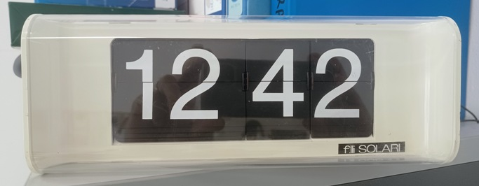
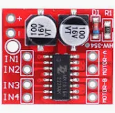
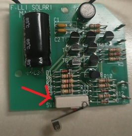
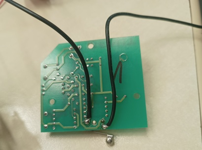

# Solari Metor Controller (in progress)

## Descrizione

Orologio elettromeccanico prodotto da Solari qualche decennio fa ... Per info consultare: http://www.assosrl.it/catalogo/fuori-commercio/metor.
Il suo funzionamento era basato su una scheda master di controllo a cui gli orologi venivano collegati in parallelo e venivano azionati dalla stessa scheda tramite una tensione di 24v.
la scheda master generava un impulso di durata breve, ogni minuto invertendone alternativamente la polarità. La piccola schedina a bordo dell'orologio si occupava di attivare il motorino DC collegato alla meaccanica delle palette, e di gestire l'interruttore di fine corsa in modo da fermare il movimento del motorino dopo lo scatto del minuto in maniera precisa.
Inutile dire che non è semplice recuperare la scheda originale ed è sicuramente più laborioso riprogettare una scheda che la emuli.

Per lo sviluppo di questa applicazione sono partito da alcuni punti fissi:
- Utilizzare 5 Volt come alimentazione e non 24 in modo da utilizzare la stessa alimentazione della JefBoard.
- Bypassare la circuitazione a bordo dell'orologio preservando lo stesso funzionamento elettromeccanico.

Per ottenere il funzionamento era dunque necessario azionare direttamente il motorino DC ogni 60 secondi e gestire l'interrutore di fine corsa in modo opportuno.

## Componenti

La jefBoard (ovviamente) può essere assemblata senza i componenti relativi al WIFI; per pilotare il motorino DC poi ho utilizzato una scheda driver di piccole dimensioni tipo questa:

https://it.aliexpress.com/item/1005006532295626.html



Quest'ultima va benissimo per la tensione e la corrente che dovrà gestire e in più è veramente piccola e può comodamente essere inserita all'interno del box dell'orologio.

La scheda può pilotare tipicamente due motori  ma in questo caso utilizzeremo solo la prima coppia di pin di output (Motor A); come si intuisce sarà sufficiente fornie un livello logico positivo piuttosto che negativo sui pin di input (IN1, IN2) per azionare il motorino.
L'altro aspetto da gestire è quello dello switch di finecorsa originale:



In questo caso visto che utilizzeremo un PINCHANGE interrupt sarà sufficiente utilizzare due contatti dello switch e collegarli direttamente alla jefBoard:



## Schema elettrico

## Codice

Il codice è abbastanza semplice: in pratica il motorino verrà attivato ogni 60 secondi utilizzando la funzione delay, e il pin change interrupt PCINT0 provvederà a "spegnere" il motorino dopo l'avanzamento meccanico del minuto.

```
/*
 * Solari Metor Controller.c
 *
 * Created: 08/03/2024 12:00:07
 * Author : g.culotta
 */ 

#include <avr/io.h>
#include <util/delay.h>
#include <avr/interrupt.h>
//#define F_CPU 2000000UL

void step();
int intr_count=0;

ISR(PCINT0_vect) {	
		
		PORTB &= ~(1 << PINB7);           // switch PB7 off
}


int main(void)
{
	
	//Setup
	DDRB |= (1 << PINB7) | (1 << PINB6);	// Set  as OUTPUT	
	DDRB &= ~ (1 << PINB1);					      // define PB1 as input
	PORTB |= 1 << PINB1;				         	// enable pull up resistor at PB1
		                             
	GIMSK |= 1 << PCIE0;      // enable PCINT[0:7] pin change interrupt
	PCMSK0 |= 1 << PCINT1;    // configure interrupt at PB1 (PCINT1)
	sei();                    // globally enable interrupts
	
       
	while (1){
		step();			
		_delay_ms(60008);
		}		
		return 0;   /* never reached */
}


void step(){
	PORTB |=  (1 << PINB7);           // switch PB7 on
	PORTB &= ~(1 << PINB6);           // switch PB6 off	
}
```

## Taratura

Purtroppo a causa di piccole tolleranze nella componentistica e malgrado siano stati correttamente settati i FUSEBITS nell'attiny2313 in accordo con la frequenza del quarzo che nel mio caso è da 16 MHZ e il prescaler che avevo settato a CKDIV8 (vedi https://github.com/jef238/jefBoard?tab=readme-ov-file#1-impostazione-fuse-bits) utilizzato sono stato costretto ad utilizzare un valore di 60007 ms piuttosto che 60000 ms come ci si aspetterebbe