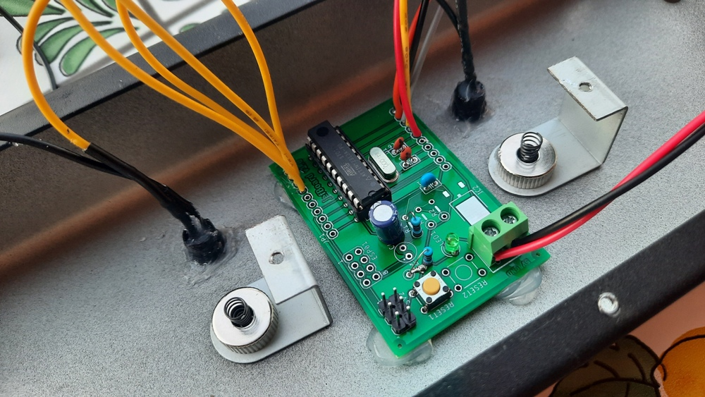
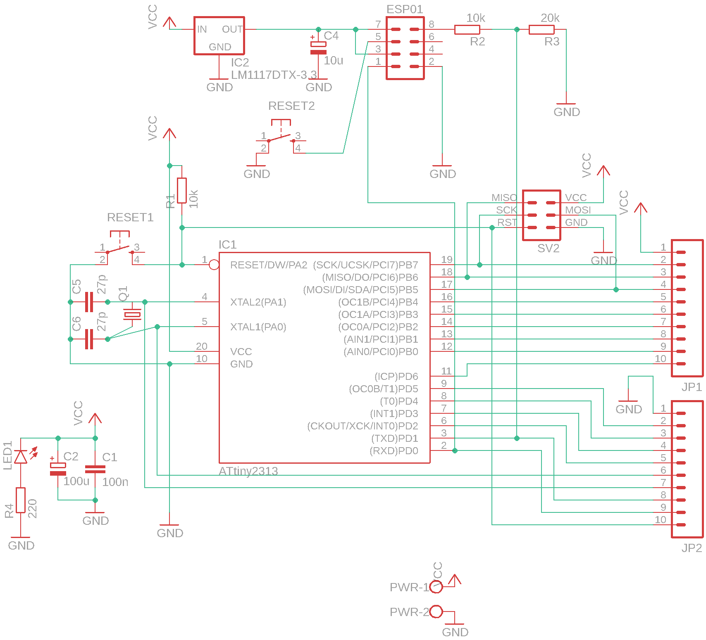
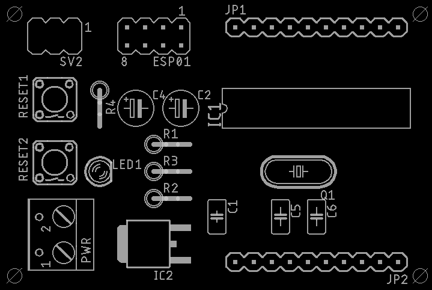
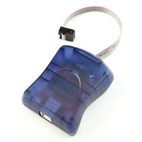
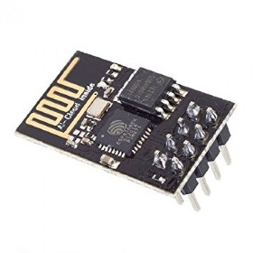
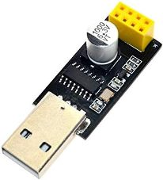
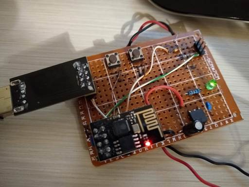

# jefBoard

## Cos'è

JefBoard è una piattaforma hardware a basso costo basata sul microcontroller Attiny2313 della ATMEL. Si presta allo sviluppo di applicazioni di varia natura e integra la predisposizione per la scheda WiFI ESP-01 (Opzionale) e il connettore per la programmazione ISP dell'Attiny2313.
Alcune caratteristiche:
- JefBoard espone tutti i pin dell'Attiny2313 per il loro utilizzo.
- JefBoard permette la realizzazione di applicazioni con supporto WiFi (il modulo ESP-01 comunica tramite connessione seriale con l'Attiny2313).
- JefBoard può essere assemblata anche senza l'ESP-01 e relativi componenti di alimentazione se non si necessita di supporto WiFi abbassando ulteriormente il costo.
- JefBoard è una scheda di piccole dimensioni 6x4 cm.

# Schema ed elenco componenti



# PCB Layout



## Elenco componenti

| Sigla | Valore                        | Tipo			        | Note                                        |
|-------|-------------------------------|-------------------------------|---------------------------------------------|
| C1    | 100n           		| Condesatore poliestere        |				              |    
| C2    | 100u           		| Condesatore elettrolitico     |					      |
| C4    | 10u            		| Condesatore elettrolitico     | (Opzionale - Solo in caso di supporto WIFI) |	
| C5    | 27p            		| Condesatore ceramico          |					      |
| C6    | 27p            		| Condesatore ceramico          | 					      |
| ESP01 |                 		| Connettore pin		| (Opzionale - Solo in caso di supporto WIFI) |
| IC1   | ATtiny2313/ATtiny2313a        | AVR			        |				              |
| IC2   | LM1117DTX 3.3V 		|			        | (Opzionale - Solo in caso di supporto WIFI) |	
| JP1   |                  		| Connettore tipo M100.1	| (Opzionale)                  		      |
| JP2   |                  		| Connettore tipo M100.1	| (Opzionale)                                 |
| LED1  |                  		| LED3MM                        |				              |
| PWR   |                  		| Connettore tipo W237-102      | (Opzionale)                                 |
| Q1    |                   		| Quarzo 4MHZ    	        |	                                      |
| R1    | 10k            		| Resistore 1/4w                |                                             |
| R2    | 10k            		| Resistore 1/4w 		| (Opzionale - Solo in caso di supporto WIFI) |	
| R3    | 20k            		| Resistore 1/4w 	        | (Opzionale - Solo in caso di supporto WIFI) |	
| R4    | 220            		| Resistore 1/4w                | 					      |
| RESET1|                  		| Microswitch                   |                                             |
| RESET2|                 		| Microswitch			| (Opzionale - Solo in caso di supporto WIFI) |
| SV2   |                   		| Connettore pin                |                                             |
         
# Caricare un firmware sull'ATTINY2313

Questa sezione verrà documentata in modo più accurato in futuro... Per il momento riporto gli appunti utili per la programmazione degli ATTINY2313 utilizzando Xcode (Mac) e [CrossPack for AVR Development](https://github.com/obdev/CrossPack-AVR).
Come programmatore per l'ISP è stato utilizzato l'USBtinyISP:



## 1. Impostazione FUSE bits    

- Utilizzare AVR Calculator per ottenere la stringa corretta (http://www.engbedded.com/fusecalc)

    ESEMPI:
    ```
    /* Oscillatore interno 1MHZ */     -U lfuse:w:0x64:m -U hfuse:w:0xdf:m -U efuse:w:0xff:m
    /* Quarzo esterno da 3 a 8MHZ */   -U lfuse:w:0xfd:m -U hfuse:w:0xdf:m -U efuse:w:0xff:m     
    ```
- Impostare i FUSE Bits nell'Attiny2313:
   ```
   avrdude -c usbtiny -p t2313 -e -U lfuse:w:0xfd:m -U hfuse:w:0xdf:m -U efuse:w:0xff:m
   ```

## 2. Compilazione

- Modificare le righe seguenti nel file Makefile (ATTENZIONE: la riga FUSES deve essere identica alle impostazioni di FUSE Bits dell'Attiny2313; in questo esempio si utilizza un quarzo esterno da 4MHZ):
	```
	DEVICE     = attiny2313
	CLOCK      = 4000000
	PROGRAMMER = -c usbtiny -p attiny2313
	OBJECTS    = main.o
	FUSES      = -U lfuse:w:0xFD:m -U hfuse:w:0xDF:m -U efuse:w:0xFF:m -U lock:w:0xFF:m
  ```
- effettuare build (verrà generato main.hex)
                                                              
## 3. Collegare l'USBtinyISP

- Assicurarsi di aver correttamente collegato il programmatore al computer e di aver installato i driver per il suo funzionamento

- Collegare l'USBtinyISP al connettore SV2 in questo modo:

  (foto)

## 4. Flash

- Caricare il file .hex nel chip: 
   ```
   avrdude -c usbtiny -p t2313 -e -U flash:w:main.hex
   ```
# Utilizzo dell'ESP01 per il supporto WIFI



L'ESP01 è un modulo SOC basato sul chip ESP8266 che permette di aggiungere il supporto al WIFI in modo semplice ed economico.
Prima di inserirlo sulla jefBoard è necessario fare una precisazione:
L'ESP01 viene fornito generalmente con un firmware dotato di soli comandi AT per cui prima di utilizzarlo nei nostri progetti è necessario caricare il firmware nodeMCU (https://it.wikipedia.org/wiki/NodeMCU). Con questo firmware è possibile programmare facilmente l'ESP01 tramite linguaggio LUA ed è possibile compilare una versione custom di nodeMCU con il supporto delle librerie/funzionalità necessarie in base all'utilizzo su https://nodemcu-build.com.

E' necessario inoltre dotarsi di un adattore USB seriale TTL:



## Istruzioni per l’installazione di esptool su MACOSX:

- Scaricare e scompattare esptool (https://github.com/espressif/esptool)

- Assicurarsi di avere Python 1.7 o successivo installato sul sistema

- Spostarsi sulla directory appena scompattata ed eseguire:
   ```
   sudo python setup.py install
   ```

## Istruzioni per flash nodemcu su ESP01
Esistono tanti modi per abilitare la modalità flash su ESP-01 (una ricerca su google è altamente consigliata...). Tempo fa ho realizzato una scheda che per comodità mi permette di riavviare tramite reset l'ESP01 (pulsante 1) mentre metto a massa il pin GPIO0 (pulsante 2):

- Posizionare l’ESP01 e l’interfaccia seriale/USB sulla scheda di programmazione:

  

- Per settare l’ESP01 in modalità flash tenere premuto il pulsante 2 e contemporaneamente effettuare un reset premendo e rilasciando il pulsante 1; dopo qualche istante rilasciare il pulsante 2.

- Effettuare il comando (nodemcu_base_int.bin è il nome del file del firmware nodemcu da flashare vedi cartella esp8266):
   ```  
   python esptool.py --port /dev/tty.wchusbserialfa140 write_flash 0x00000 nodemcu_base_int.bin
   ```
- (opzionale) restore firmware originale (11/12/2019)
   ``` 
   python esptool.py --port /dev/tty.wchusbserialfd130 write_flash 0x00000 v0.9.2.2\ AT\ Firmware.bin
   ``` 
## Programmazione ESP01 tramite script LUA
Una volta caricato il firmware nodeMCU è possibile caricare gli script LUA. Il file init.lua (vedi cartella esp8266) viene caricato all'avvio in maniera automatica.
E' possibile utilizzare il software ESPlorer (https://github.com/4refr0nt/ESPlorer) per caricare sia gli script LUA che per gestire al meglio l'ESP01
