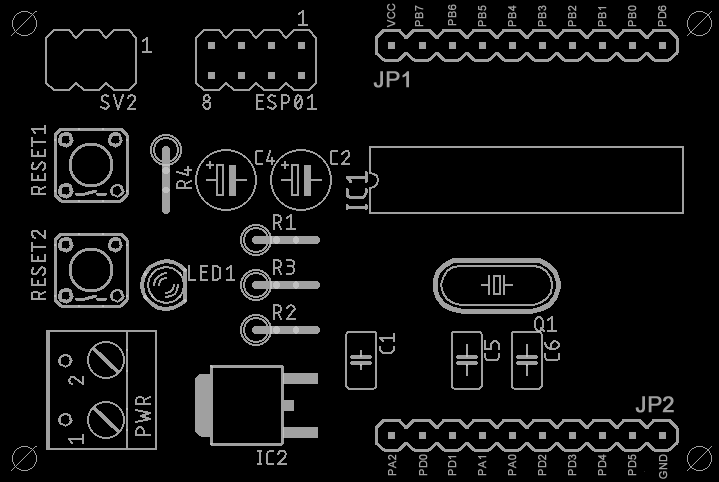

# jefBoard

## Cos'è

JefBoard è una piattaforma hardware a basso costo basata sul microcontroller Attiny2313 della ATMEL. Si presta allo sviluppo di applicazioni di varia natura e integra la predisposizione per la scheda WiFI ESP-01 (Opzionale) e il connettore per la programmazione ISP dell'Attiny2313.
Alcune caratteristiche:
- JefBoard espone tutti i pin dell'Attiny2313 per il loro utilizzo.
- JefBoard permette la realizzazione di applicazioni con supporto WiFi (il modulo ESP-01 comunica tramite connessione seriale con l'Attiny2313).
- JefBoard può essere assemblata anche senza l'ESP-01 e relativi componenti di alimentazione se non si necessita di supporto WiFi abbassando ulteriormente il costo.
- JefBoard è una scheda di piccole dimensioni 6x4 cm.

# Schema ed elenco componenti




## Elenco componenti

| Sigla | Valore                        | Tipo			        | Note                                        |
|-------|-------------------------------|-------------------------------|---------------------------------------------|
| C1    | 100n           		| Condesatore poliestere        |				              |    
| C2    | 100u           		| Condesatore elettrolitico     |					      |
| C4    | 10u            		| Condesatore elettrolitico     | (Opzionale - Solo in caso di supporto WIFI) |	
| C5    | 27p            		| Condesatore ceramico          |					      |
| C6    | 27p            		| Condesatore ceramico          | 					      |
| ESP01 |                 		| Connettore pin		| (Opzionale - Solo in caso di supporto WIFI) |
| IC1   | ATtiny2313/ATtiny2313a        | AVR			        |				              |
| IC2   | LM1117DTX 3.3V 		|			        | (Opzionale - Solo in caso di supporto WIFI) |	
| JP1   |                  		| Connettore tipo M100.1	| (Opzionale)                  		      |
| JP2   |                  		| Connettore tipo M100.1	| (Opzionale)                                 |
| LED1  |                  		| LED3MM                        |				              |
| PWR   |                  		| Connettore tipo W237-102      | (Opzionale)                                 |
| Q1    |                   		| Quarzo 4MHZ    	        |	                                      |
| R1    | 10k            		| Resistore 1/4w                |                                             |
| R2    | 10k            		| Resistore 1/4w 		| (Opzionale - Solo in caso di supporto WIFI) |	
| R3    | 20k            		| Resistore 1/4w 	        | (Opzionale - Solo in caso di supporto WIFI) |	
| R4    | 220            		| Resistore 1/4w                | 					      |
| RESET1|                  		| Microswitch                   |                                             |
| RESET2|                 		| Microswitch			| (Opzionale - Solo in caso di supporto WIFI) |
| SV2   |                   		| Connettore pin                |                                             |
         
# Caricare un firmware sull'ATTINY2313

Questa sezione verrà documentata in modo più accurato in futuro... Per il momento riporto gli appunti utili per la programmazione degli ATTINY2313 utilizzando Xcode (Mac) e [CrossPack for AVR Development](https://github.com/obdev/CrossPack-AVR).
Come programmatore per l'ISP è stato utilizzato l'USBtinyISP [USBtinyISP](https://www.tinyosshop.com/usbtinyisp-avr-isp-programmer) 

## 1. Impostazione FUSE bits    

- Utilizzare AVR Calculator per ottenere la stringa corretta (http://www.engbedded.com/fusecalc)

    ESEMPI:
    ```
    /* Oscillatore interno 1MHZ */     -U lfuse:w:0x64:m -U hfuse:w:0xdf:m -U efuse:w:0xff:m
    /* Quarzo esterno da 3 a 8MHZ */   -U lfuse:w:0xfd:m -U hfuse:w:0xdf:m -U efuse:w:0xff:m     
    ```
- Impostare i FUSE Bits nell'Attiny2313:
   ```
   avrdude -c usbtiny -p t2313 -e -U lfuse:w:0xfd:m -U hfuse:w:0xdf:m -U efuse:w:0xff:m
   ```

## 2. Compilazione

- Modificare le righe seguenti nel file Makefile (ATTENZIONE: la riga FUSES deve essere identica alle impostazioni di FUSE Bits dell'Attiny2313; in questo esempio si utilizza un quarzo esterno da 4MHZ):
	```
	DEVICE     = attiny2313
	CLOCK      = 4000000
	PROGRAMMER = -c usbtiny -p attiny2313
	OBJECTS    = main.o
	FUSES      = -U lfuse:w:0xFD:m -U hfuse:w:0xDF:m -U efuse:w:0xFF:m -U lock:w:0xFF:m
  ```
- effettuare build (verrà generato main.hex)
                                                              
## 3. Collegare l'USBtinyISP

- Assicurarsi di aver correttamente collegato il programmatore al computer e di aver installato i driver per il suo funzionamento

- Collegare l'USBtinyISP al connettore SV2 in questo modo:

  

## 4. Flash

- Caricare il file .hex nel chip: 
   ```
   avrdude -c usbtiny -p t2313 -e -U flash:w:main.hex
   ```
# Utilizzo dell'ESP01 per il supporto WIFI

(work in progress)
